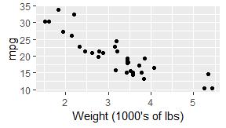
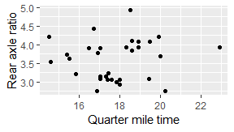
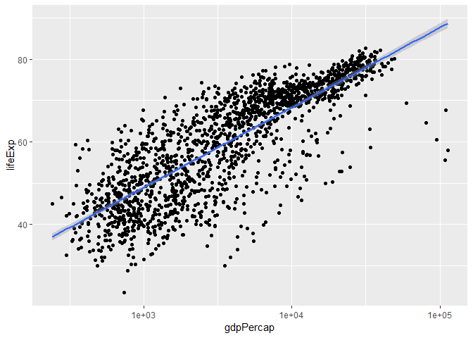

cm014 Worksheet: The Model-Fitting Paradigm in R
================
Rowenna Gryba
2018\_test

``` r
suppressPackageStartupMessages(library(tidyverse))
library(gapminder)
library(broom)
```

So you want to fit a model to your data. How can you achieve this with R?

Topics:

1.  What *is* model-fitting?
2.  How do we fit a model in R?
3.  How can we obtain tidy results from the model output?

What is Model-Fitting?
----------------------

When variables are not independent, then we can gain information about one variable if we know something about the other.

Examples: Use the scatterplot below:

1.  A car weighs 4000 lbs. What can we say about its mpg?
2.  A car weights less than 3000 lbs. What can we say about its mpg?

``` r
library(tidyverse)
ggplot(mtcars, aes(wt, mpg)) +
  geom_point() +
  labs(x = "Weight (1000's of lbs)")
```



Example: What can we say about rear axle ratio if we know something about quarter mile time?

``` r
ggplot(mtcars, aes(qsec, drat)) + 
  geom_point() +
  labs(x = "Quarter mile time",
       y = "Rear axle ratio")
```



If EDA isn't enough, we can answer these questions by fitting a model: a curve that predicts Y given X. Aka, a **regression curve** or a **machine learning model**.

(There are more comprehensive models too, such as modelling entire distributions, but that's not what we're doing here)

There are typically two goals of fitting a model:

1.  Make predictions.
2.  Interpret variable relationships.

Fitting a model in R
--------------------

Model fitting methods tend to use a common format in R:

    method(formula, data, options)

They also tend to have a common output: a special *list*.

**Method**:

A function such as:

-   Linear Regression: `lm`
-   Generalized Linear Regression: `glm`
-   Local regression: `loess`
-   Quantile regression: `quantreg::rq`
-   ...

**Formula**:

In R, takes the form `y ~ x1 + x2 + ... + xp` (use column names in your data frame).

**Data**: The data frame.

**Options**: Specific to the method.

Exercise:

1.  Fit a linear regression model to life expectancy ("Y") from log(GDP per capita) ("X") by filling in the formula. Notice what appears as the output.
2.  On a new line, use the `unclass` function to uncover the object's true nature: a list. Note: it might be easier to use the `names` function to see what components are included in the list.

``` r
names(gapminder)
```

    ## [1] "country"   "continent" "year"      "lifeExp"   "pop"       "gdpPercap"

``` r
(my_lm <- lm(lifeExp ~ log(gdpPercap), data=gapminder))
```

    ## 
    ## Call:
    ## lm(formula = lifeExp ~ log(gdpPercap), data = gapminder)
    ## 
    ## Coefficients:
    ##    (Intercept)  log(gdpPercap)  
    ##         -9.101           8.405

To complicate things further, some info is stored in *another* list after applying the `summary` function:

``` r
summary(my_lm) %>% 
  names()
```

    ##  [1] "call"          "terms"         "residuals"     "coefficients" 
    ##  [5] "aliased"       "sigma"         "df"            "r.squared"    
    ##  [9] "adj.r.squared" "fstatistic"    "cov.unscaled"

We can use the `predict()` function to make predictions from the model (default is to use fitting/training data). Here are the predictions:

``` r
predict(my_lm) %>% 
  head()
```

    ##        1        2        3        4        5        6 
    ## 46.86506 47.30012 47.62400 47.45579 46.42835 46.93666

We can plot models (with one predictor/ X variable) using `ggplot2` through the `geom_smooth()` layer. Specifying `method="lm"` gives us the linear regression fit (but only visually!):

``` r
ggplot(gapminder, aes(gdpPercap, lifeExp)) +
    geom_point() +
    geom_smooth(method="lm") +
    scale_x_log10()
```



Broom
-----

Let's make it easier to extract info, using the `broom` package. There are three crown functions in this package, all of which input a fitted model, and outputs a tidy data frame.

1.  `tidy`: extract statistical summaries about each component of the model.
    -   Useful for *interpretation* task.
2.  `augment`: add columns to the original data frame, giving information corresponding to each row.
    -   Useful for *prediction* task.
3.  `glance`: extract statistical summaries about the model as a whole (1-row tibble).
    -   Useful for checking goodness of fit.

Exercise: apply all three functions to our fitted model, `my_lm`. What do you see?

``` r
tidy(my_lm)
```

    ## # A tibble: 2 x 5
    ##   term           estimate std.error statistic  p.value
    ##   <chr>             <dbl>     <dbl>     <dbl>    <dbl>
    ## 1 (Intercept)       -9.10     1.23      -7.41 1.93e-13
    ## 2 log(gdpPercap)     8.41     0.149     56.5  0.

``` r
augment(my_lm)
```

    ## # A tibble: 1,704 x 9
    ##    lifeExp log.gdpPercap. .fitted .se.fit .resid    .hat .sigma .cooksd
    ##  *   <dbl>          <dbl>   <dbl>   <dbl>  <dbl>   <dbl>  <dbl>   <dbl>
    ##  1    28.8           6.66    46.9   0.290 -18.1  0.00144   7.61 4.07e-3
    ##  2    30.3           6.71    47.3   0.284 -17.0  0.00139   7.61 3.45e-3
    ##  3    32.0           6.75    47.6   0.279 -15.6  0.00134   7.61 2.84e-3
    ##  4    34.0           6.73    47.5   0.282 -13.4  0.00137   7.61 2.13e-3
    ##  5    36.1           6.61    46.4   0.296 -10.3  0.00151   7.62 1.39e-3
    ##  6    38.4           6.67    46.9   0.289  -8.50 0.00144   7.62 8.95e-4
    ##  7    39.9           6.89    48.8   0.264  -8.92 0.00120   7.62 8.27e-4
    ##  8    40.8           6.75    47.6   0.279  -6.80 0.00135   7.62 5.36e-4
    ##  9    41.7           6.48    45.3   0.311  -3.66 0.00167   7.62 1.92e-4
    ## 10    41.8           6.45    45.1   0.314  -3.38 0.00169   7.62 1.68e-4
    ## # ... with 1,694 more rows, and 1 more variable: .std.resid <dbl>

``` r
glance(my_lm)
```

    ## # A tibble: 1 x 11
    ##   r.squared adj.r.squared sigma statistic p.value    df logLik    AIC
    ## *     <dbl>         <dbl> <dbl>     <dbl>   <dbl> <int>  <dbl>  <dbl>
    ## 1     0.652         0.652  7.62     3192.       0     2 -5877. 11760.
    ## # ... with 3 more variables: BIC <dbl>, deviance <dbl>, df.residual <int>
